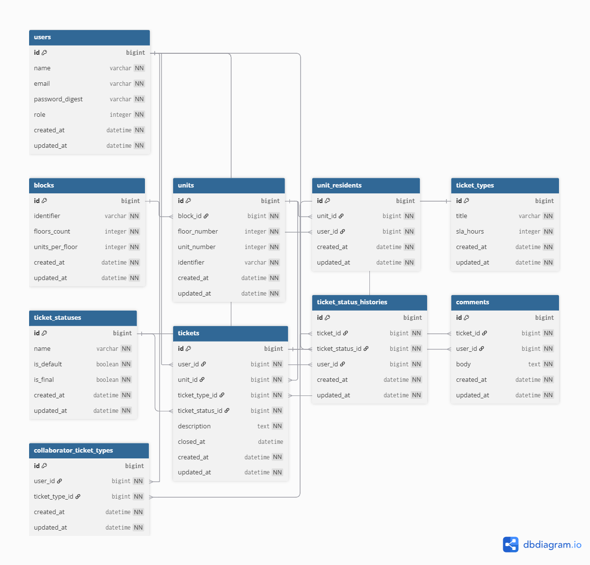

# Sistema de Gerenciamento de Chamados para Condomínio

> Desafio Técnico Nº 0004/2026 — Dunnas Tecnologia  
> Stack: Ruby on Rails 8.1 · PostgreSQL · Tailwind CSS · Hotwire

---

## Sumário

1. [Visão Geral](#visão-geral)
2. [Decisões Técnicas](#decisões-técnicas)
3. [Estrutura do Sistema](#estrutura-do-sistema)
4. [Funcionalidades](#funcionalidades)
5. [Diagrama Relacional](#diagrama-relacional)
6. [Gems e Dependências](#gems-e-dependências)
7. [Instruções de Execução](#instruções-de-execução)
8. [Credenciais Iniciais](#credenciais-iniciais)
9. [Testes](#testes)
10. [Versionamento](#versionamento)
11. [Extras Implementados](#extras-implementados)

---

## Visão Geral

Aplicação web desenvolvida em **Ruby on Rails 8.1** seguindo o padrão **MVC**, para gerenciar chamados de manutenção e suporte em condomínios. O sistema contempla uma estrutura hierárquica de **blocos → andares → unidades**, três perfis de usuário com permissões distintas, e um ciclo de vida completo para os chamados, incluindo histórico de status, comentários e anexos via Active Storage.

---

## Decisões Técnicas

### Framework e Arquitetura

**Ruby on Rails 8.1 com padrão MVC** foi escolhido por eu ter uma experiencia previa e por oferecer um conjunto maduro de ferramentas que aceleram o desenvolvimento sem abrir mão de organização:

- **Convenção sobre configuração**: a estrutura de pastas e as convenções do Rails mantêm o código previsível e fácil de navegar.
- **Active Record**: o ORM nativo simplifica os relacionamentos entre modelos (associações, validações, callbacks) e reduz a quantidade de SQL manual.
- **Migrations**: todo o histórico de alterações no banco está versionado. O banco pode ser recriado do zero com `rails db:migrate`, e o schema atual está na versão `2026_04_13_224842`.

### Banco de Dados

**PostgreSQL** foi utilizado em vez do SQLite padrão do Rails por oferecer suporte robusto a constraints de integridade referencial, melhor desempenho em ambientes concorrentes e ser amplamente adotado em produção. Todos os relacionamentos possuem `foreign_key` explícita no schema, garantindo consistência dos dados no nível do banco.

### Autenticação

Autenticação implementada com **`has_secure_password`** (bcrypt), sem dependências externas como Devise. Essa escolha mantém o fluxo de autenticação simples, auditável e completamente sob controle da aplicação.

### Controle de Acesso (Autorização)

O papel do usuário é armazenado como `integer enum` na coluna `role` da tabela `users` (default `2` = morador). O controle de acesso é aplicado via `before_action` nos controllers, verificando o papel do usuário autenticado antes de cada ação sensível. As views também adaptam sua renderização conforme o papel.

### Escopo de Colaboradores

Foi implementada a tabela `collaborator_ticket_types`, que define quais **tipos de chamado** cada colaborador tem acesso. Isso permite um escopo granular: um colaborador de manutenção, por exemplo, só vê chamados do tipo "Elétrica" ou "Hidráulica", sem acesso aos demais.

### Histórico de Status (Auditoria)

Em vez de registrar apenas o status atual, o sistema mantém a tabela `ticket_status_histories`, que guarda cada transição de status com o usuário responsável e o momento da alteração. Isso cria um **log de auditoria** completo do ciclo de vida de cada chamado.

### SLA em Horas

O SLA dos tipos de chamado foi modelado como `sla_hours` (inteiro, em horas), e não em dias, permitindo maior granularidade na definição dos prazos de atendimento.

### Geração Automática de Unidades

Ao cadastrar um bloco informando `identifier`, `floors_count` e `units_per_floor`, as unidades são geradas automaticamente via callback no model `Block`, com identificadores no formato `<bloco>-<andar><unidade>` (ex: `A-101`, `A-102`, `B-201`), garantindo consistência e rastreabilidade.

### Upload de Arquivos

**Active Storage** com **ImageMagick/MiniMagick** para armazenamento e pré-visualização de anexos nos chamados. O schema inclui as três tabelas nativas do Active Storage: `active_storage_blobs`, `active_storage_attachments` e `active_storage_variant_records`.

### Frontend

- **Tailwind CSS 4** para estilização responsiva com utilitários diretamente nas views ERB.
- **Hotwire (Turbo + Stimulus)** para interatividade sem a necessidade de um frontend separado (SPA).
- **Hotwire LiveReload** para acelerar o ciclo de desenvolvimento local.

### Paginação

**Kaminari** para paginação das listagens de chamados, mantendo performance mesmo com grande volume de registros.

---

## Estrutura do Sistema

```
app/
├── controllers/
│   ├── application_controller.rb        # Autenticação base e helpers de autorização
│   ├── sessions_controller.rb           # Login / logout
│   ├── users_controller.rb              # Gestão de usuários (admin)
│   ├── blocks_controller.rb             # Cadastro de blocos (admin)
│   ├── units_controller.rb              # Visualização de unidades
│   ├── ticket_types_controller.rb       # Tipos de chamado com SLA (admin)
│   ├── ticket_statuses_controller.rb    # Status de chamados (admin)
│   ├── tickets_controller.rb            # Ciclo de vida dos chamados
│   └── comments_controller.rb          # Comentários nos chamados
├── models/
│   ├── user.rb                          # enum role: { admin: 0, collaborator: 1, resident: 2 }
│   ├── block.rb                         # callback: gera unidades automaticamente
│   ├── unit.rb
│   ├── unit_resident.rb                 # N:N entre moradores e unidades
│   ├── collaborator_ticket_type.rb      # N:N: escopo de tipos por colaborador
│   ├── ticket_type.rb                   # título + sla_hours
│   ├── ticket_status.rb                 # is_default / is_final
│   ├── ticket.rb                        # callback: preenche closed_at no status final
│   ├── ticket_status_history.rb         # log de todas as trocas de status
│   └── comment.rb
├── views/
│   ├── layouts/
│   ├── sessions/
│   ├── users/
│   ├── blocks/
│   ├── units/
│   ├── ticket_types/
│   ├── ticket_statuses/
│   ├── tickets/
│   └── comments/
db/
├── migrate/          # Todas as alterações versionadas via Rails migrations
├── schema.rb         # Versão atual: 2026_04_13_224842
└── seeds.rb          # Admin padrão, status iniciais e tipos de chamado de exemplo
test/
├── models/           # Testes unitários dos models
├── controllers/      # Testes dos controllers
└── factories/        # Factories com Factory Bot
```

---

## Funcionalidades

### Administrador

| Funcionalidade | Descrição |
|---|---|
| Cadastro de Blocos | Informa `identifier`, `floors_count` e `units_per_floor`. As unidades são geradas automaticamente no formato `<bloco>-<andar><apt>` (ex: `A-101`). |
| Cadastro de Moradores | Cria usuários com papel de morador e os vincula a uma ou mais unidades via `unit_residents`. |
| Vínculo Morador ↔ Unidade | Gerencia quais moradores têm acesso a quais unidades. |
| Tipos de Chamado | Cadastra tipos com `title` e `sla_hours` (prazo máximo de resolução em horas). |
| Status de Chamados | Define os possíveis status do ciclo de vida. Um status é marcado com `is_default` (inicial) e outro com `is_final` (conclusão). |
| Gestão de Usuários | Visualiza, edita e gerencia todos os usuários do sistema. |
| Escopo de Colaboradores | Vincula tipos de chamado a colaboradores via `collaborator_ticket_types`. |
| Gestão de Chamados | Acesso completo a todos os chamados. |

### Colaborador

| Funcionalidade | Descrição |
|---|---|
| Visualizar Chamados | Acessa chamados dos tipos vinculados ao seu escopo. |
| Filtrar Chamados | Filtra por status, tipo, bloco e período. |
| Atualizar Status | Altera o status de um chamado. Cada alteração gera um registro em `ticket_status_histories`. A `closed_at` é preenchida automaticamente quando o status final é aplicado. |
| Comentários | Adiciona comentários ao histórico de qualquer chamado no seu escopo. |

### Morador

| Funcionalidade | Descrição |
|---|---|
| Abrir Chamado | Seleciona uma de suas unidades vinculadas, escolhe o tipo, descreve o problema e anexa arquivos. O chamado nasce com o status marcado como `is_default`. |
| Acompanhar Chamados | Visualiza apenas os chamados das suas unidades. |
| Comentários | Comenta apenas nos chamados das suas próprias unidades. |
| anexos | pode adicionar anexos ao comentários . |

### Chamados — Regras de Negócio

- Todo chamado nasce com o **status padrão** (`is_default: true`).
- Apenas **administradores e colaboradores** podem alterar o status.
- Cada troca de status gera um registro em **`ticket_status_histories`** com o usuário e o momento da alteração.
- A **`closed_at`** é preenchida automaticamente quando o chamado recebe o status com `is_final: true`.
- Anexos são suportados via Active Storage com pré-visualização de imagens.

---
## Diagrama Relacional




Link para melhor visualização: https://dbdiagram.io/d/condoflow-dunnas-688e6a48cca18e685cf53535

**Resumo dos relacionamentos:**

| Relacionamento | Tipo | Via |
|---|---|---|
| `Block` → `Unit` | 1:N | `block_id` em `units` |
| `User` ↔ `Unit` (moradores) | N:N | `unit_residents` |
| `User` ↔ `TicketType` (colaboradores) | N:N | `collaborator_ticket_types` |
| `Ticket` → `Unit` | N:1 | `unit_id` em `tickets` |
| `Ticket` → `User` (autor) | N:1 | `user_id` em `tickets` |
| `Ticket` → `TicketType` | N:1 | `ticket_type_id` em `tickets` |
| `Ticket` → `TicketStatus` | N:1 | `ticket_status_id` em `tickets` |
| `Ticket` → `Comment` | 1:N | `ticket_id` em `comments` |
| `Ticket` → `TicketStatusHistory` | 1:N | `ticket_id` em `ticket_status_histories` |
| `Ticket` → Anexos | 1:N | Active Storage |

---

## Gems e Dependências

| Gem | Finalidade |
|---|---|
| `rails ~> 8.1.3` | Framework principal |
| `pg` | Adaptador PostgreSQL |
| `bcrypt ~> 3.1.7` | Hash de senha via `has_secure_password` |
| `tailwindcss-rails ~> 4.4` | Estilização com Tailwind CSS |
| `turbo-rails` | Navegação SPA-like sem JS extra (Hotwire) |
| `stimulus-rails` | Componentes JS leves (Hotwire) |
| `kaminari` | Paginação de listagens |
| `image_processing ~> 1.2` + `mini_magick` | Transformação e pré-visualização de imagens (Active Storage) |
| `dotenv-rails` | Variáveis de ambiente em desenvolvimento |
| `factory_bot_rails` | Factories para testes |
| `faker` | Geração de dados fictícios nos testes |
| `capybara` + `selenium-webdriver` | Testes de sistema (end-to-end) |
| `hotwire-livereload` | Live reload em desenvolvimento |
| `solid_cache` / `solid_queue` / `solid_cable` | Cache, filas e Action Cable via banco de dados |
| `propshaft` | Pipeline de assets moderno |
| `bootsnap` | Redução do tempo de boot |
| `brakeman` | Análise estática de segurança |
| `rubocop-rails-omakase` | Linting e estilo de código |

---

## Instruções de Execução

### Pré-requisitos

- Ruby **3.3+**
- Rails **8.1+**
- PostgreSQL **14+**
- Node.js (para Tailwind CSS)
- ImageMagick

### 1. Clonar o repositório

```bash
git clone https://github.com/davigledson/condoflow-app.git
cd condoflow-app

```

### 2. Instalar dependências

```bash
bundle install
```

### 3. Configurar credentials (Rails)

```bash
rails credentials:edit
```
Isso cria:

config/master.key

config/credentials.yml.enc

### 4. Configurar variáveis de ambiente

Crie um arquivo `.env` na raiz :

```env

DB_USERNAME=postgres
DB_PASSWORD=senha
DB_HOST=localhost
DB_PORT=5432

RAILS_MASTER_KEY=sua_master_key


```

### 5. Criar e migrar o banco de dados

```bash
rails db:create
rails db:migrate
rails db:seed
```

> O `db:seed` popula o banco de dados com um conjunto robusto de dados iniciais para desenvolvimento e testes. Ele cria:

- **Usuários**: dois administradores, dois colaboradores e cerca de 30 moradores (incluindo os que abrem chamados).

- **Status de chamado**: Aberto (padrão), Em andamento, Concluído (final) e Cancelado (final).

- **Tipos de chamado**: Manutenção Elétrica, Manutenção Hidráulica, Limpeza e Segurança, cada um com seu SLA.

- **Blocos e unidades**:
  - Bloco A (3 andares, 4 aptos/andar = 12 unidades)
  - Bloco B (2 andares, 3 aptos/andar = 6 unidades)

- **Vinculações de moradores**: cada morador é associado a uma ou mais unidades.

- **Chamados**: aproximadamente 20 chamados abertos, com diferentes tipos, status e descrições.

- **Comentários e histórico de status**: vários comentários e registros de alteração de status para simular a evolução real dos chamados.
### 6. Iniciar o servidor

```bash
rails server
```

Acesse em: [http://localhost:3000](http://localhost:3000)

---

### Execução com Docker

Siga esses passos aqui:
[configuraçoes para docker](docs/setup-docker.md)

O projeto pode ser executado localmente com apenas um comando:


```bash
docker compose up
```

O `docker-compose.yml` sobe a aplicação Rails e o PostgreSQL automaticamente, executa as migrations e o seed. Nenhuma instalação local de Ruby, Rails ou PostgreSQL é necessária.

---

## Credenciais Iniciais

Após executar `rails db:seed` (ou `docker compose up`):

| Papel | E-mail | Senha |
|---|---|---|
| Administrador | `admin@condominio.com` | `123456` |
| Administrador | `keyllian@dunnas.com` | `123456` |
| Colaborador | `admin@condominio.com` | `123456` |
| Colaborador | `davi@condominio.com` | `123456` |
| Morador | `joao@email.com` | `123456` |

> **Atenção**: altere a senha do administrador imediatamente após o primeiro acesso em produção.

---

## Testes

Os testes foram escritos com **Minitest** (framework padrão do Rails) e **Factory Bot** para geração de dados de teste.

### Executar todos os testes

```bash
rails test
```

### Executar testes de um model específico

```bash
rails test test/models/user_test.rb
rails test test/models/ticket_test.rb
```

### Cobertura dos testes unitários

| Model | O que é testado |
|---|---|
| `User` | Validações de nome, e-mail único e senha; enum de papéis (`admin`, `collaborator`, `resident`) |
| `Block` | Validações de `identifier` único, `floors_count` e `units_per_floor`; geração automática de unidades via callback |
| `Unit` | Formato do `identifier`; unicidade da combinação `(block_id, floor_number, unit_number)` |
| `TicketType` | Validações de `title` e `sla_hours` (deve ser positivo) |
| `TicketStatus` | Unicidade do `is_default`; unicidade do `is_final`; validações de nome |
| `Ticket` | Status inicial padrão ao criar; preenchimento automático de `closed_at` ao finalizar; validações de presença |
| `Comment` | Validações de `body`; restrição de escopo por papel (morador só comenta nas suas unidades) |
| `TicketStatusHistory` | Registro automático a cada troca de status; presença de `ticket_id`, `ticket_status_id` e `user_id` |

---

## Versionamento

### GitFlow

O desenvolvimento seguiu o modelo **GitFlow** com a seguinte estrutura de branches:

| Branch | Finalidade |
|---|---|
| `main` | Código estável de produção |
| `dev` | Branch de integração de features |
| `feature/*` | Desenvolvimento de novas funcionalidades |
| `fix/*` | Correções de bugs |
| `release/*` | Preparação de versões para produção |

**Fluxo adotado:**

```
feature/nome-da-feature ──┐
                          ├──► develop ──► release/x.x.x ──► main
fix/nome-do-fix ──────────┘
```

Toda funcionalidade foi desenvolvida em sua própria branch criada a partir de `develop`. A branch `main` recebeu merges apenas via `release`, garantindo que somente código revisado e testado chegue à produção.

### Conventional Commits

Os commits seguem o padrão **[Conventional Commits](https://www.conventionalcommits.org/)**, facilitando a leitura do histórico e a identificação do impacto de cada alteração:

```
<tipo>(<escopo>): <descrição curta>

[corpo opcional]

[rodapé opcional]
```

**Tipos utilizados:**

| Tipo | Quando usar |
|---|---|
| `feat` | Nova funcionalidade |
| `fix` | Correção de bug |
| `refactor` | Refatoração sem mudança de comportamento |
| `test` | Adição ou correção de testes |
| `docs` | Alterações na documentação |
| `chore` | Configuração, dependências, CI |
| `style` | Formatação e lint (sem mudança de lógica) |
| `db` | Migrations e alterações de schema |

**Exemplos de commits do projeto:**

```
fix: corrigindo papel no colaborador, que agora pode ser atribuido a tipos de chamados.
db: configurando banco de dados e fazendo migrações
feat: adição da funcionalide de anexos nos comentarios e nos chamados. 
test: fazendo os testes unitarios dos models. fix: corringindo erro do docker
docs: fazendo documentação para setup do projeto, tanto local como com o docker
chore(docker): configuração do Docker para ambiente de produção
```

---

## Extras Implementados

| Item | Status |
|---|---|
| Testes unitários (Minitest + Factory Bot) | ✅ Implementado |
| Docker Compose (`docker compose up`) | ✅ Implementado |
| Auditoria de status via `ticket_status_histories` | ✅ Implementado |
| GitFlow + Conventional Commits + Commits Assinados | ✅ Implementado |
| Deploy em ambiente público | ✅ [Acesse aqui](https://condoflow-app.onrender.com) |
---

 
## Deploy

A aplicação está rodando em produção no **Render** (PaaS gratuito).  
Link: [https://condoflow-app.onrender.com](https://condoflow-app.onrender.com)

O deploy foi realizado diretamente a partir da branch `main` do repositório GitHub. O ambiente de produção utiliza:
- PostgreSQL gerenciado pelo Render
- Variáveis de ambiente configuradas via dashboard
- Build automático a cada push na `main`

>  Por se tratar de um plano gratuito, o serviço pode “dormir” após períodos de inatividade. O primeiro acesso após um tempo ocioso pode levar alguns segundos para reativar o container.

---


## Contato

Desenvolvido como parte do processo seletivo da **Dunnas Tecnologia**.  
Data de entrega: **16/04/2026**